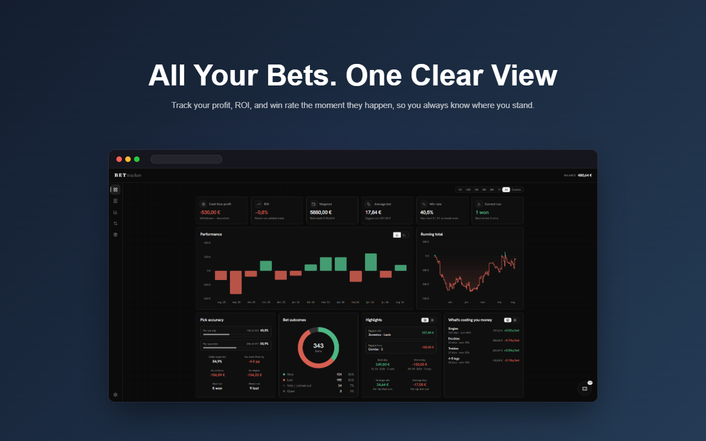

<div align="center">



<h1>BETtracker</h1>

<h3>All your bets. One clear view.</h3>

<p>
  <a href="https://microsoftedge.microsoft.com/addons/detail/bettracker/dofgloogkcigmpnkmoaefnejeffdbcmi">
    
  </a>
  <a href="https://github.com/Martinek16/BETtracker/releases/latest">
    
  </a>
</p>

<p>
  
  
  
  <a href="https://github.com/Martinek16/BETtracker/actions/workflows/ci.yml"></a>
  <a href="LICENSE"></a>
</p>

</div>

***

Your bookmaker shows today's balance and a list going back a few pages, one
account at a time. So the one question you actually have, **am I up or am I
down**, has no answer on the screen.

BETtracker reads your own history and answers it. On your computer, nowhere
else.

## Install

| Browser | What to do | Worth knowing |
|:--|:--|:--|
| **Edge** | [Get it from Microsoft&nbsp;Edge&nbsp;Add&#8209;ons](https://microsoftedge.microsoft.com/addons/detail/bettracker/dofgloogkcigmpnkmoaefnejeffdbcmi). One click. | Updates itself. |
| **Chrome, Brave, Opera** | [Download the zip](https://github.com/Martinek16/BETtracker/releases/latest) and unzip it. Open `chrome://extensions`, turn on **Developer mode**, click **Load unpacked** and pick the folder. | Keep that folder: deleting it uninstalls the extension. |

> [!NOTE]
> There is no Chrome listing because Google removes gambling related extensions from its store, even ones that only read your own history. Edge accepted it.

Then sign in at a bookmaker as you always do, and say yes once when the
extension asks whether it may read that account. Your bets appear. Older
history fills in over the next few visits, a page at a time. It only looks
backwards: no tips, no predictions, no telling you what to bet.
[**How it works, screen by screen**](docs/HOW_IT_WORKS.md)

## Bookmakers it can read

| Bookmaker | Bets | Balance | Money in and out | Bonuses |
|:--|:-:|:-:|:-:|:-:|
|  [**bet-at-home**](extension/src/bookmakers/bet-at-home/) | Yes | Yes | Yes | Yes |
|  [**Stake**](extension/src/bookmakers/stake/) | Yes | Yes | Yes | Yes |

Both work on all their addresses: country domains, numbered mirrors, and
whatever they switch to next.

## Your data never leaves

No account, no server, no analytics. Your bets, payments and balances stay in
your browser, on your disk. It reads pages you already opened, so it never
sees a password and cannot place a bet, deposit or withdraw. Export the lot to
a file whenever you like, or delete it in one click.

Besides your bookmakers it calls two addresses: a public exchange rate feed
and a public coin price feed. Neither is told anything about you, and a test
in the build fails if a bookmaker ever names a third.
[**Privacy policy**](PRIVACY.md)

## Questions people ask

<details>
<summary><b>Can it bet with my money?</b></summary><br>
No. It only reads pages you have already opened, and never sees your password.
</details>

<details>
<summary><b>Why is an old bet missing?</b></summary><br>
Long histories are read backwards, one page at a time. Open the bookmaker and leave the tab a moment.
</details>

<details>
<summary><b>Why did an account stop updating?</b></summary><br>
The bookmaker signed you out. Open its site again and it picks up where it left off.
</details>

<details>
<summary><b>Is casino play counted?</b></summary><br>
No. Only sports bets. Casino money shows up as a smaller balance.
</details>

<details>
<summary><b>What about currencies, and crypto?</b></summary><br>
Everything is converted on the day the bet was placed, not today, so last year's profit does not move because a rate did. Crypto stakes go through the coin's own daily close.
</details>

<details>
<summary><b>Will my bookmaker mind?</b></summary><br>
It reads the same pages your browser already loaded, with your own session, slower than you clicking. That said, plenty of bookmakers write their terms broadly enough to cover anything they dislike. Your account, your call.
</details>

***

# Join in

Nobody can keep up with every betting site. That is why this is open.

<table>
<tr>
<td width="50%" valign="top">

### A bookmaker is one folder

Everything a site needs lives in one directory, and adding it touches nothing
else in the project. That is what makes a stranger's work reviewable in an
evening.

```
extension/src/bookmakers/your-site/
   bookmaker.json     what the site is called
   capture.ts         how it is recognised
   adapter.ts         how it is read
   samples.ts         proof it parsed
   logo.png           its mark
   __fixtures__/      recorded answers
```

</td>
<td width="50%" valign="top">

### Four steps, one evening

1. **Record.** Click through your own bet history with DevTools open, and save it.
2. **Strip it.** One command removes your tokens, your name and your account number.
3. **Let it write.** `/add-bookmaker yoursite` in Claude Code reads the recording and writes the folder.
4. **Prove it.** Load the extension, check your own numbers, open a pull request.

[**The whole process, step by step**](docs/ADD_A_BOOKMAKER.md)

</td>
</tr>
</table>

<table>
<tr>
<td width="50%" valign="top">

### Your site broke

Bookmakers change their API without telling anyone. Fix the folder you use.

</td>
<td width="50%" valign="top">

### Ask for a site

No account there yourself?
[Request it](https://github.com/Martinek16/BETtracker/issues/new?template=new-bookmaker.yml)
and somebody who plays there may pick it up.

</td>
</tr>
<tr>
<td width="50%" valign="top">

### Report a bug

A number that looks wrong is worth an
[issue](https://github.com/Martinek16/BETtracker/issues/new?template=bug.yml).
Wrong figures are the only real failure here.

</td>
<td width="50%" valign="top">

### Say what is missing

A figure you keep working out by hand belongs on a screen.
[Say so](https://github.com/Martinek16/BETtracker/discussions).

</td>
</tr>
</table>

> [!IMPORTANT]
> **You may add a bookmaker. The shared core stays closed.** One change to how bets are stored or totalled can break every site at once, and the person who finds out is a stranger whose figures went quietly wrong. So contributions add sites, they do not change how sites work. CI checks it before a human reads the pull request, and every folder is held to the same tests: no invented ids, no money that is not a number, no site talking to a host that is not its own.

[**Contributing guide**](CONTRIBUTING.md) &nbsp;·&nbsp;
[**Discussions**](https://github.com/Martinek16/BETtracker/discussions) &nbsp;·&nbsp;
[**Security**](https://github.com/Martinek16/BETtracker/security/advisories/new)

***

<sub>
MIT licensed. For adults only. This tool measures losses, it does not stop
them. If gambling stops being something you control,
<a href="https://www.begambleaware.org/">BeGambleAware</a> and
<a href="https://www.gamblersanonymous.org/">Gamblers Anonymous</a> are free
and confidential.
</sub>
